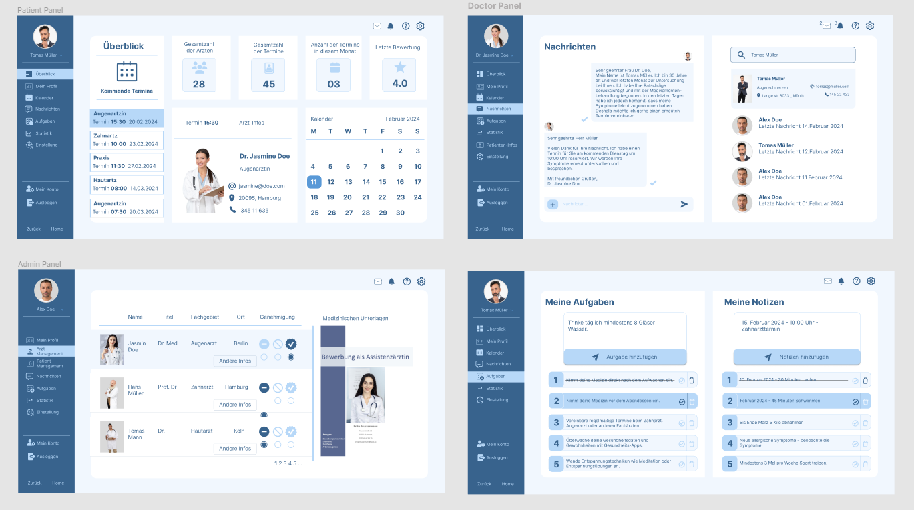
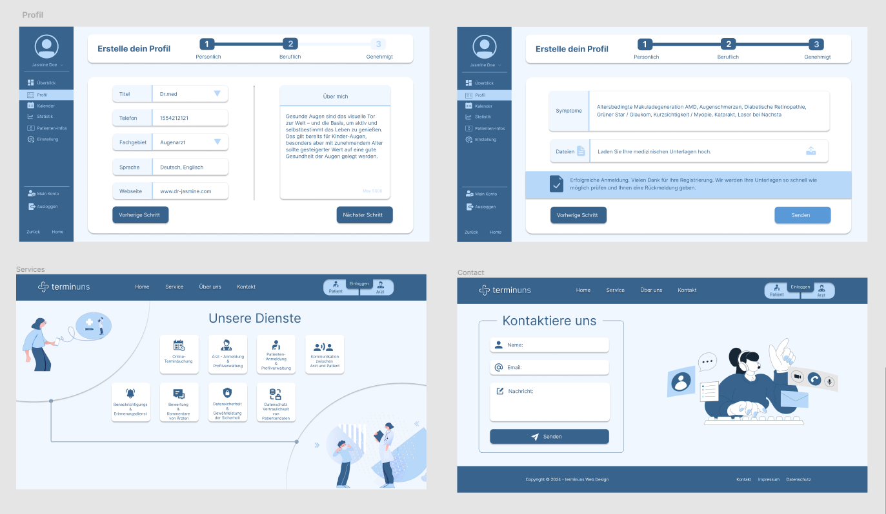

# Patient - Doctor Appointment App

This project includes a full-stack web application that allows patients and doctors to schedule and manage appointments.





## Technologies

- **Frontend:**

  - Created using React.
  - Utilizes libraries such as React Router, Tailwind, Formik, Yup, and Toastify.

- **Backend:**
  - Developed with Node.js and Express.js.
  - Utilizes MongoDB as the database, integrated with Mongoose.
- **Authentication and Authorization:**
  - User authentication is managed using Token Authentication.
  - Authorization is implemented using React Router's security features.

## Project Structure

- **client:** Frontend code

  - **src:**
    - **components:** React components
    - **pages:** Application pages
    - **utils:** Helper functions and constants

- **server:** Backend code
  - **controllers:** MongoDB operations and business logic
  - **models:** MongoDB schemas
  - **routes:** API routes
  - **config:** Firebase and other configuration files

## Installation

1. **Frontend Installation:**
   ```bash
   cd client
   npm install
   npm start
   ```

How Terminuns App work?
Doctors and patients must be registered to the system in order to be able to use it. Non-registered users can search for doctors and free appointments, but must be registered to have a patient panel and to get appointments.
After a doctor registers himself/herself to the system, she/he must enter her/his doctor panel and fill the information form. the form also includes the proof of the doctor’s background like diplom and certificates.
When a doctor sends all the information to the system, the website admin will check the eligibility and validity of the documents and approve/authorize the doctor’s account.
Now, the doctor can reach her/his panel. In the first step, she/he should enter weekly working hours to the system in Einstellungen page. This step is critical because the doctor should rigoriously specify her/his date range for using the Terminuns-App. After she/he creates the appointments, patients will be able to get appointments and in a case of mistakenly created free appointments, it will be difficult to cancel all these appointments.
A patient needs no admin validation to use the system in the beginning. After she/he registers herself/himself, she/he can automatically access her/his panel.
A patient can search for not only doctors in close locations and but also the branches. After she/he lists the doctors by relevance, she/he can see also doctors’ free appointments and get an appointment.
After an appointment is taken, the patient will get an email notification. She/he can see all of incoming and the past appointments in the Überblick(Overview) page.
Doctors can also see all of their daily appointments in Überblick(Overview) page in their panel. They can see their past and future appointments in Kalender(Calendar) page. Patients are also able to see their past and future appointments.
Patients and doctors can see national or regional holidays in their Überblick(Overview) and Kalender(Calendar) pages.
Patients and doctors can cancel their appointments and specify a reason for the cancellation. The cancel operation can be conducted if there are more than 24 hours to the appointment. When an appointment is cancelled, both of the parties will get notifications through their panels and emails.
Patients and doctors can add important events to their calendars in Kalender(Calendar) pages.
Patients and doctors can create tasks or notes for themselves in Aufgaben(Tasks) and Notizen(Notes) pages.
Patients and doctors can see their statistics in Statistik(Statistics) pages. These statistics involve the ratio of cancelled and realized appointments, the number of appointments in the last week, last month and the last year, the number of doctors/patients she/he has made appointments, the number of messages and patients/doctors she/he has sent/received and the website new user statistics.
Patients and doctors can send messages to patients/doctors and receive messages from them. After each message, they will be warned via navbar.
Patients and doctors can edit their profiles whenever they want, they can add profile pictures.
Dark theme is coming soon...
language options is also in creation process...
